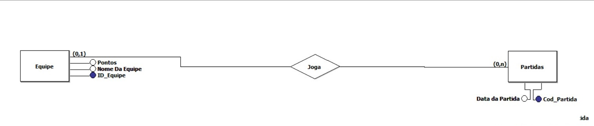

# Módulo 4 - Visualizando a situação 

<h1>Objetivo do projeto</h1>

Motamos um dashboard, a partir da análise da dados e das perguntas elaboradas pelo nosso grupo. O dashboard foi feito com base no <b>conjunto de dados escolhidos e  oferecidos pela Resilia</b>, a fim de realizar uma apresentação com a exploração dos dados.

<h1>Script de criação </h1>
<li>Criar tabela</li>
  <ul>Create database NBA</ul>
<li>Importando tabela</li>
<ul>1 - Abra o XAMPP</ul>
<ul>2 - Abre o phpadmin</ul>
<ul>3 - Importe o arquivo <b>vinte.cls</b></ul>

<i>OBS: vinte se refere à todas as partidas acontecidas no ano de 2020</i>

<ul>4- No final, clique na opção que diz que o gráfico já tem colunas </ul>

<h1>Script de Consulta</h1>

<li>Qual equipe que ganhou mais partidas na temporada 2020? </li>
<ul>SELECT * FROM vinte ORDER BY W DESC LIMIT 1;</ul>
<li>Qual equipe que perdeu mais partidas na temporada 2020? </li>
<ul>SELECT * FROM vinte ORDER BY L DESC LIMIT 1;</ul>
<li>Quais times fizeram menos pontos em 2020?</li>
<ul>SELECT * FROM `vinte` ORDER BY G ASC;</ul>
<li>Quais times fizeram mais pontos na temporada de 2020?</li>
<ul>SELECT * FROM `vinte` ORDER BY G DESC;</ul>
<li>Quantas partidas aconteceram na temporada de 2020?</li>
<ul>select count(SEASON_ID) from vinte;</ul>
<li>Quantas partidas o time Milwaukee fez em 2020? </li>
<ul>select count(SEASON_ID) from vinte where TEAM = 'Milwaukee';</ul>

<h1> Modelagem dos Dados</h1>

